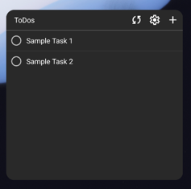
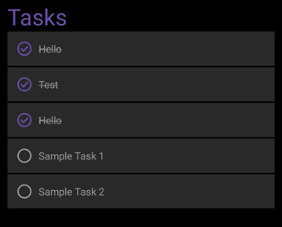

# Android TodoList App

A todolist app for android with state of the art technology.

## Technology

* Full Kotlin and Gradle Kotlin DSL
* Android X and Room Database
* Jetpack Glance for Widget

## Screenshots

|                |                                   |
|----------------|-----------------------------------|
| Widget         |  |
| Home Screen    |    |
| View/Edit ToDo |    |

## Documentation

* The App follows a three layer architecture:
  * `dataaccess`: Access to data sources
    * `room`: Room-Database for storing and caching todos
    * ...
  * `businesslogic`: Business logic of the app
  * `ui`: Logic bound to the UI of the app
    * `screens`: Jetpack Compose screens
    * `widgets`: Jetpack Glance widgets
    * `theme`: Theme of the app